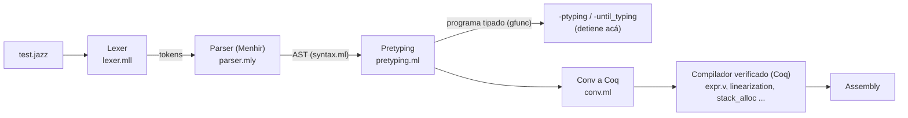
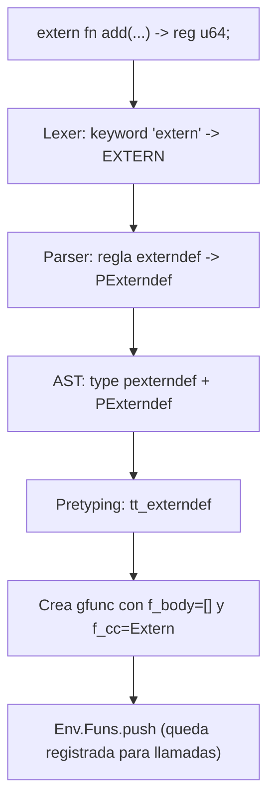
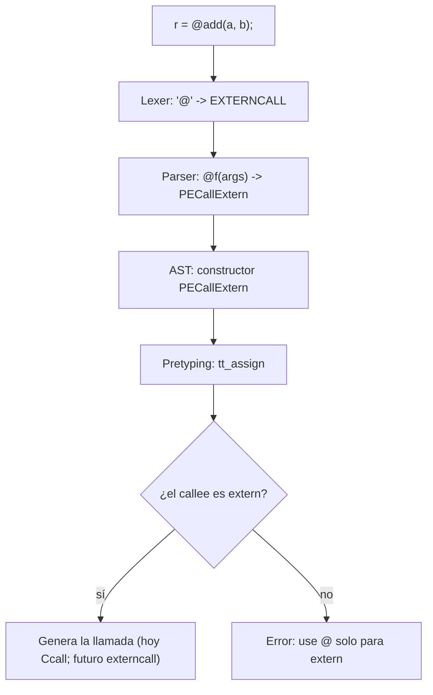

# Implementación de funciones `extern` y llamadas `@` — Resumen

> Documento de seguimiento. Explica los cambios hechos, el flujo del compilador,
> qué hace cada archivo, y el estado actual. Se usa **mermaid** para los diagramas.

---

## 1. Visión general

Implementamos el soporte para **funciones externas** (sin cuerpo) en el frontend de Jasmin:

1. **Declaración**: `extern fn add(reg u64 x, reg u64 y) -> reg u64;`
2. **Llamada**: las funciones externas se llaman con **`@`**: `r = @add(a, b);`

Según el director, en este compilador lo que hoy se llama `syscall` es en realidad una
**llamada a función externa** (`externcall`). Por eso el diseño apunta a que el `@`
termine mapeando a un `externcall`/`Csyscall` en el IR verificado (fase Coq pendiente).

### Estado
- ✅ **Frontend completo**: declaración + llamada con `@`, tipado e impresión.
- ⏳ **Backend / Coq pendiente**: que la llamada externa se compile y se distinga en el IR.

---

## 2. El flujo del compilador (contexto)



> `-until_typing` corta justo después del pretyping (sin backend). Por eso el frontend
> del `extern` se puede probar sin tocar Coq todavía.

---

## 3. Flujo de la declaración `extern`



---

## 4. Flujo de la llamada `@add`



---

## 5. Qué hace cada archivo (y qué se agregó)

| Archivo | Rol | Cambios para `extern` / `@` |
|---|---|---|
| `lexer.mll` | Lexer | keyword `"extern" → EXTERN`; símbolo `"@" → EXTERNCALL` |
| `parser.mly` | Parser (Menhir) | `%token EXTERN` y regla `externdef`; `%token EXTERNCALL` y reglas `@f(args)` (expr + stmt) |
| `syntax.ml` | AST | tipos `pexterndef` + constructor `PExterndef`; constructor `PECallExtern` |
| `pretyping.ml` | Pretyping/Typing | `tt_externdef` (registra función); manejo de `PECallExtern` (exige extern) y `PECall` (rechaza extern) |
| `fInfo.ml` | Convención de llamada | variante `Extern` en `call_conv` |
| `printer.ml` | Impresor (`-ptyping`) | `pp_call_conv` imprime `extern`; `pp_pfun` imprime firma sin cuerpo |
| `latex_printer.ml` | Impresor LaTeX | casos `PExterndef` y `PECallExtern` |
| `regalloc/stackAlloc/varalloc` | Backend | caso `Extern` (no-implementado, `assert false`) |
| `compile.ml` | Pipeline | trata `Extern` como no-export |
| `VariableInitialisation.ml` | Linter | saltea funciones `Extern` (sin cuerpo → sin init) |

### Detalle por fases

**Fase 1 — Declaración (Lexer + Parser + AST)**
- `lexer.mll`: keyword `extern`.
- `parser.mly`: token `EXTERN` + regla `externdef` (`EXTERN FN name args rty ;`) → `PExterndef`.
- `syntax.ml`: `type pexterndef` + `PExterndef` en `pitem`.
- Menhir con `--strict` convierte un token sin usar en **error**, por eso el token y la
  regla entraron juntos.

**Fase 2 — Semántica + impresión (Downstream)**
- `fInfo.ml`: variante `Extern` en `call_conv` (ABI externa como *caller*).
- `pretyping.ml`: `tt_externdef` construye un `gfunc` con `f_body=[]`, `f_cc=Extern` y
  variables de retorno sintetizadas (`ret_0`, ...), y lo registra en `Env.Funs`.
- `printer.ml`: `pp_pfun` imprime solo la firma `extern fn ... -> ...;` (sin cuerpo).
- `VariableInitialisation.ml`: saltea funciones `Extern` (evita falso positivo de init).

**Llamada con `@` (director)**
- `lexer.mll`: `@ → EXTERNCALL`.
- `syntax.ml`: `PECallExtern of pident * pexpr list`.
- `parser.mly`: `@f(args)` en expresión e instrucción → `PECallExtern`.
- `pretyping.ml`: `PECallExtern` exige `f_cc = Extern`; `PECall` plano **rechaza** funciones
  extern con el error `call it with @add(...)`.

---

## 6. Comandos

| Acción | Comando |
|---|---|
| Entrar al entorno | `nix-shell --pure --arg pinned-nixpkgs true` |
| Compilar | `cd compiler && make` |
| Probar declaración (frontend) | `./jasminc -until_typing <archivo>.jazz` |
| Imprimir tras typing | `./jasminc -ptyping <archivo>.jazz` |
| Correr suites de tests | `cd compiler && dune build @runtest` |

---

## 7. Tests (en `pending/`)

Toda la feature está "estacionada" en `compiler/tests/pending/` (no lo ejecuta la suite,
que solo corre `success/*` y `fail/*`):

```
compiler/tests/pending/
├── extern_decl.jazz                 <- declaración (al final → success/)
├── extern_call.jazz                 <- @add con cuerpo (al final → success/)
├── extern_call_without_marker.jazz  <- extern sin marcador falla (al final → fail/)
└── extern_call_on_non_extern.jazz   <- marcador sobre función normal falla (al final → fail/)
```

---

## 8. Pendiente / próximos pasos

- [ ] **Fase `externcall`/Coq**: que la llamada `@` se represente como `externcall` real
      en el IR verificado (`expr.v`, `syscall_t`, semántica y pruebas).
- [ ] Mover los tests de `pending/` a `success/` y `fail/` cuando el `@` sobreviva al
      round-trip de printing.
- [ ] Decidir con el director el numeral/etiqueta (`@add(1,3)` o `!#`) y la ABI.

---

## 9. Aprendizajes

- Menhir con `--strict` → token sin usar = **error** (hay que usarlo en el mismo cambio).
- Añadir un constructor a un tipo con matchs exhaustivos exige actualizarlos **todos**.
- `List.combine` exige listas del **mismo largo** (no trunca); `ret_annot` debe igualar `f_tyout`.
- Reutilizar `gfunc` (con `f_cc=Extern`) es barato porque **evita tocar el compilador
  verificado en Coq** (estructura dedicada sería muchísimo más costosa).

